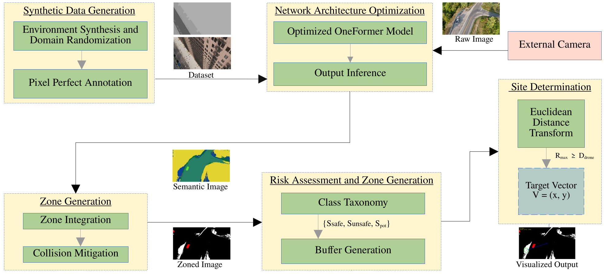
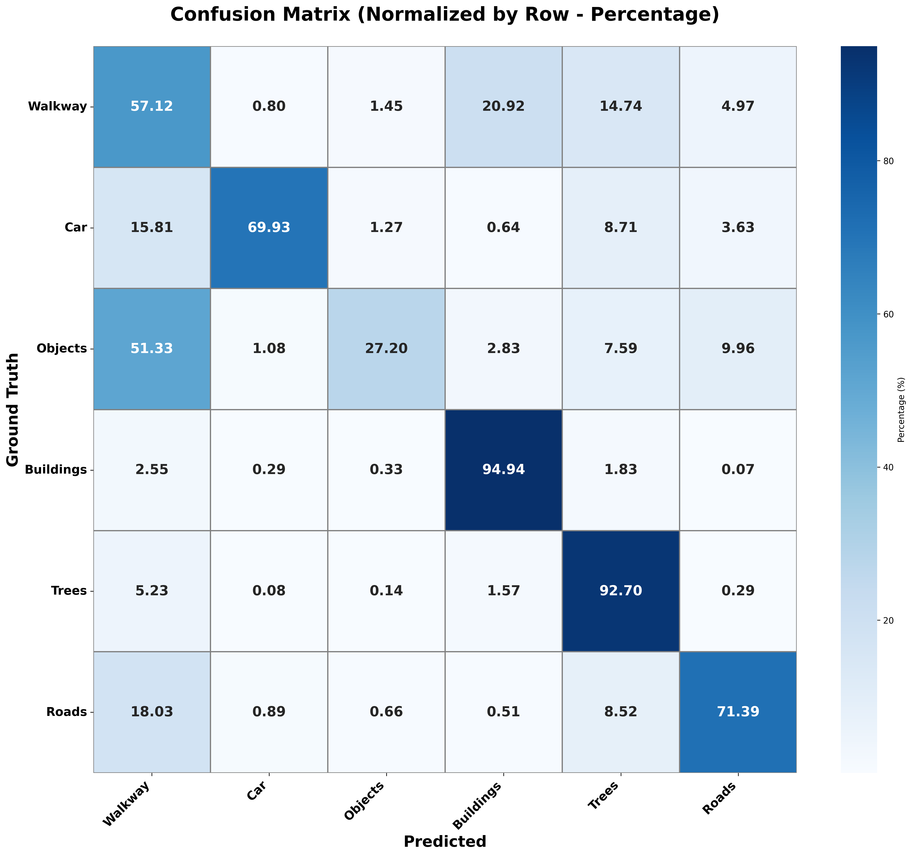

# Targeted-Landing: Autonomous UAV Landing Zone Detection

[](https://www.python.org/downloads/)
[](https://pytorch.org/)
[](https://opencv.org/)
[](https://opensource.org/licenses/MIT)

This repository contains the official implementation of a high-fidelity, monocular vision-based perception pipeline designed for autonomous Unmanned Aerial Vehicle (UAV) landing in unstructured environments. 

By leveraging Vision Transformers (OneFormer) and a robust temporal stabilization architecture, this system semantically decouples safe landing zones (e.g., drivable roads, walkways) from hazards without relying on heavy sensor fusion arrays (LiDAR/Stereo Depth) or cooperative infrastructure (ArUco tags).

## Table of Contents
- [Overview](#overview)
- [System Architecture](#system-architecture)
- [Key Features](#key-features)
- [Hardware & Software Requirements](#hardware--software-requirements)
- [Installation](#installation)
- [Usage](#usage)
- [Results & Performance](#results--performance)
- [Future Work](#future-work)

---

## Overview & Validated Contributions

The primary goal of this project is to develop a robust, modular, monocular vision-based perception system for autonomous UAV landing in unstructured, non-cooperative environments. 

By eliminating the reliance on heavy sensor arrays (LiDAR/Stereo) and cooperative infrastructure (ArUco tags), this system addresses three critical gaps in current literature:

### 1. Mitigating Data Scarcity via Synthetic Generation
* **The Approach:** Addresses the lack of annotated aerial imagery by developing a procedural synthetic data generation pipeline in Blender (template provided). 
* **The Validation:** Achieves Sim-to-Real zero-shot transfer on the real-world **UAVid benchmark (Mean F1: 0.7006)**, exhibiting superior fine-grained boundary adherence compared to human annotations.

### 2. Enhancing Perception Robustness via Vision Transformers
* **The Approach:** Replaces traditional CNNs with a Vision Transformer (`OneFormer` in our case) to capture global scene context and prevent the over-smoothing of critical geometric boundaries.
* **The Validation:** Successfully decouples physically similar but semantically distinct surfaces (e.g., active traffic lanes vs. walkways), establishing a **High-Precision Safety Profile (83.90% Safe Landing Precision)**.

### 3. Bridging Perception to Action on Edge Hardware
* **The Approach:** Overcomes the "Edge Computing Gap" by pairing the Transformer backbone with deterministic Euclidean Distance Transforms and Kalman Filtering to translate pixel probabilities into flight vectors.
---

## System Architecture

The pipeline processes monocular RGB video feeds through a 6-stage architecture optimized for edge hardware (e.g., NVIDIA Jetson AGX).

1. **Frame Preprocessing (CLAHE):** Applies Contrast Limited Adaptive Histogram Equalization to mitigate shadow artifacts and extreme illumination variance in urban canyons.
2. **Semantic Segmentation:** Utilizes a lightweight Vision Transformer (`OneFormer Swin-Tiny`) to classify the environment into unified Super Classes (Buildings, Trees, Roads, Walkways, Objects).
3. **Temporal Mask Stabilization:** Employs OpenCV DIS Optical Flow (Fast Dense Flow) combined with Temporal Mode Smoothing to warp and align masks, eliminating inter-frame semantic flickering.
4. **Dynamic Mask Merging:** Contextual heuristics merge safe classes (Walkways, empty Roads) into a Binary Safe Landing Zone (SLZ) mask, while isolating dynamic agents and static hazards into No-Fly Zones (NFZ).
5. **Landing Zone Detection:** Extracts the optimal landing centroid and maximum safe radius via spatial filtering and morphological closing operations.
6. **Trajectory Smoothing:** A 6-state Kalman Filter equipped with Euclidean distance gating (Outlier Rejection) tracks the final descent vector to prevent coordinate teleportation.

<p align="center">
  
</p>

---

## Key Features
* **Transformer-Based Perception:** Surpasses traditional CNNs (DeepLabv3+) and Single-Stage detectors (YOLOv11-seg) in resolving long-range global context and fine-grained structural details (e.g., electric poles).
* **Sim-to-Real Generalization:** Validated on proprietary DJI Mini suburban datasets and UAVid urban benchmarks without site-specific fine-tuning.
* **Edge-Feasible:** Integrates OpenCV backends for spatial and temporal filtering, allowing the heavy ViT backbone to operate effectively on constrained computing budgets.
* **Aerospace-Grade Stabilization:** Prevents erratic flight controller inputs through optical flow mask warping and kinetic state tracking.
<table align="center">
  <tr>
    <td align="center">
      <b>Suburban Domain</b><br>
      
    </td>
    <td align="center">
      <b>Urban Domain</b><br>
      
    </td>
  </tr>
</table>
---

## Hardware & Software Requirements

### Recommended Hardware
* **Workstation Prototyping:** Tested on RTX A6000 for ~1 Segmentation/s - Performance is Model dependant.
* **Edge Deployment:** NVIDIA Jetson AGX Orin / Jetson Orin Nano.

### Software Dependencies
* Ubuntu 20.04 / 22.04
* Python 3.8+
* CUDA 11.8+
* `torch`, `torchvision`
* `opencv-python`, `numpy`, `scipy`

---

## Installation

1. **Clone the repository:**
   ```bash
   git clone [https://github.com/ShrikB/Targeted-Landing.git](https://github.com/ShrikB/Targeted-Landing.git)
   cd Targeted-Landing
   ```

2. **Set up the virtual environment:**
   ```bash
   python3 -m venv venv
   source venv/bin/activate
   ```

3. **Install dependencies:**
   ```bash
   pip install -r requirements.txt
   ```

4. **Model Weights:**
   Place your custom fine-tuned OneFormer weights in the `model/` directory.
   ```text
   Targeted-Landing/
   ├── model/
   │   └── model11_cusdat/
   ```

---

## Usage

The main pipeline can be executed via the primary inference script. Configuration for video inputs, model paths, and CLAHE parameters can be adjusted directly in the script header.

```bash
python Simulated_Modular_Test.metric.py
```

### Output Structure
The pipeline automatically generates timed analytics and distinct output folders for debugging and verification:
```text
outputs/
├── extracted_frames/       # Raw & CLAHE-enhanced RGB frames
├── semantic_output/        # Stabilized OneFormer segmentation masks
├── masked_output/          # Binary SLZ/NFZ merged masks
├── landing_zones/          # Final vector targeting overlays
└── processing_timing.json  # Stage-by-stage latency analytics
```

For dataset generation, a template for generating raw and masks is provided given the City Generation Add-On is enabled. Simply activate Generate.py file followed by the Maskup.py file.
The generic template for both can be adjusted for more classes, frames, variances, plus any specific changed enabled by the Blender Engine.

<p align="center">
  
</p>

---

## Results & Performance

### Safety Evaluation
The pipeline was subjected to a Binary Suitability Analysis to evaluate its viability as a Conservative Filter.
* **Ignored/NFZ Recall:** `99.39%` (Near-perfect hazard avoidance).
* **Safe/SLZ Precision:** `83.90%` (High confidence in selected landing zones).
* **Mean Safety Precision:** `0.8499` (Good to Excellent confidence interval).

### Computational Latency (Frame-by-Frame)
* **Desktop Workstation (RTX A6000):** ~1.17s / frame.
* **Jetson AGX Edge Hardware:** ~6.67s / frame.
*(Note: Landing zone designation is a discrete, low-frequency event. The precision of the ViT justifies the latency over standard high-frequency obstacle avoidance).*
<p align="center">
  
</p>
---

## 🔭 Future Work
To scale this architecture from a research prototype to a field-deployable system, the following optimizations are on the roadmap:
* **NVIDIA TensorRT Integration:** Migrating the PyTorch inference backend to optimized TensorRT engines to maximize tensor core utilization on the Jetson AGX.
* **Docker Containerization:** Encapsulating the ROS, CUDA, and PyTorch dependency chain to ensure seamless portability across heterogeneous UAV platforms.
* **Dynamic Garbage Collection:** Implementing an automated storage management protocol for edge devices. To prevent storage exhaustion during sustained flights via rolling buffer.
---

## 📝 License
This project is licensed under the MIT License - see the [LICENSE](LICENSE) file for details.
